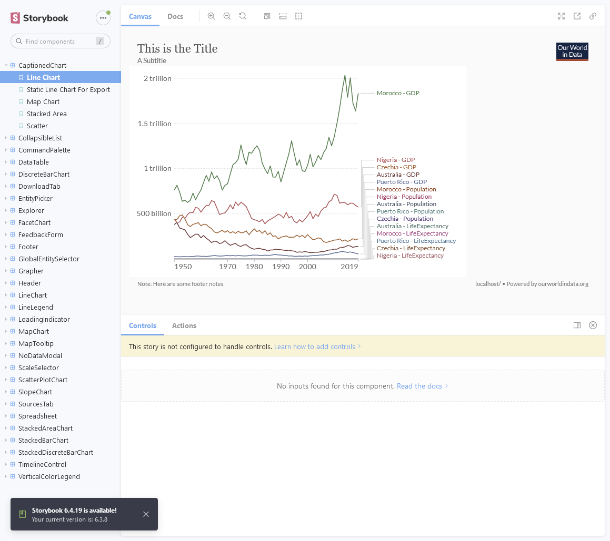

# Visual Studio Code Devcontainer setup

This page describes how to run our develpment environment entirely within a VS Code devcontainer setup - i.e. without instally NodeJS, Mysql etc locally. All that is required is to have needs [VS Code](https://code.visualstudio.com/) with the [remote containers extension](https://code.visualstudio.com/docs/remote/containers) and the [docker runtime](https://www.docker.com/) installed.

Once you have the tools mentioned above installed, just open this repository in VS Code. You should see a notice in the lower left that asks if you want to open this again inside a development container. Answer yes and it will spin that up. Note that the first time you run this it needs to download and ingest the database which takes between 5-15 minutes.

Once the database has been loaded run the following steps:

1. Run `yarn` in the terminal in VS code to install all javascript dependencies including typescript and webpack
2. Run `yarn buildTsc` to build the first version of our JS artifacts
3. run `yarn startTmuxServer`. This should split the terminal in 3 panes using tmux and run 3 components, one in each pane:
    1. The `typescript --watch` command that recompiles typescript whenever you make a change to a _.ts or _.tsx file
    2. The admin server so you can create charts in a web browser
    3. The webpack server to build all the CSS files

Now navigate to http://localhost:3030/admin/charts and have a look at the admin interface. The default user account is `admin@example.com` with a password of `admin`

Press `Ctrl/Cmd B + &` to kill the window and end all 3 processes when you are done

## Running tests

To run our test suite you first need to build the typescript files into javascript and then run jest:

1. Run buildTsc

    ```sh
    yarn buildTsc
    ```

2. Run jest

    ```sh
    yarn testJest
    ```

## Using storybook

Storybook allows you to interact with our Grapher and Explorer components visually in a browser and can be a great way to debug or to test new features.

1. Run buildTsc

    ```sh
    yarn buildTsc
    ```

2. Run jest

    ```sh
    yarn startStorybookServer
    ```


