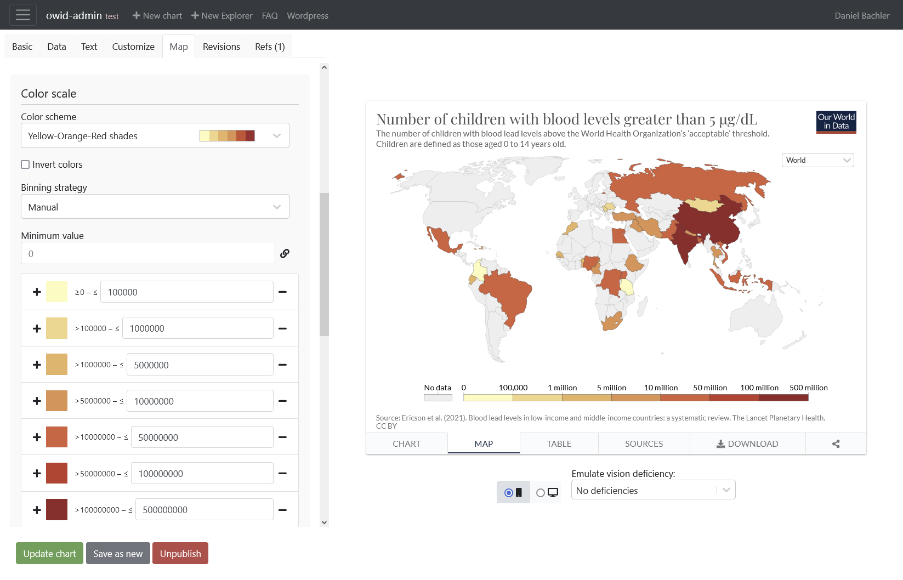

# Local development setup with mysql and the Grapher admin

This page describes how to set up a mysql database loaded with example charts so you can use the Admin UI to visually create and edit charts.

Before you get to the steps here you have to set up a local typescript development environment as documented [here](local-typescript-setup.md).



## Prerequisites

We use [docker](https://www.docker.com/) to unify our development setup. Additionally, we provide a make file to automate downloading the required database dumps and starting all the required services.

This means that on your computer you'll need to install [docker](https://www.docker.com/) and a few utilities:

### Mac OS installation steps

```bash
brew install tmux
```

### Linux/Windows intallation steps

On Windows we only support development using the Windows Subsystem for Linux. In the steps below we assume that you are using a debian/ubuntu flavour on Linux.

```bash
apt install -y build-essential finger tmux
```

## Additional optional prequisites

If you want to work with the explorer admin then you need to clone the "owid-content" folder as a **sibling** to the owid-grapher. Note that this is not required just to create or edit single charts which is normally sufficient for development of new features or bug fixes.

    ```bash
    git clone https://github.com/owid/owid-content
    ```

# Starting our development environment

One quick thing to check is if you are already running MySQL on your computer at port 3306 and if so to stop this service while running the docker setup. Our docker based setup tries to expose the MySQL docker container at port 3306 of your computer for easy interaction with other tools (e.g. a SQL editor). If this port is already taken then starting this container will fail.

All you need to do now is to open a terminal and run

```bash
make up
```

This should fire up a tmux console with 4 tabs:

1. A tab that gives a brief overview of how to use this tmux setup
2. A tab that outputs the docker compose container logs
3. A tab that shows the result of the typescript watch compiler process
4. A tab that shows the output of the webpack and admin server watch processes

The first time you run this it will take a while to download and set up the database (5-15 minutes is expected). Switch to the database tab and wait until you see this message:

```
✅ All done, grapher DB is loaded ✅
```


Now you can open [http://localhost:3030/admin/charts](http://localhost:3030/admin/charts) and start creating charts. Any changes to the typescript code you make will be automatically compiled but you will have to refresh the admin page to see changes (i.e. we don not have a hot reloading setup that you may know from other React projects).

Note that in the MySQL database that was set up, the `data_values` table will be incomplete – it will only contain data used in charts. In production, this table is >30GB (uncompressed) and contains unreviewed and undocumented data, so we currently don't offer a full export of it.

### Inspecting the database

On macOS, we recommend using [Sequel Pro](http://www.sequelpro.com/) (it's free). [DBeaver](https://dbeaver.io/) is also free, works well also and is available on more operating systems.

We also have [**a rough sketch of the schema**](https://user-images.githubusercontent.com/1308115/64631358-d920e680-d3ee-11e9-90a7-b45d942a7259.png) as it was on November 2019 (there may be slight changes).
